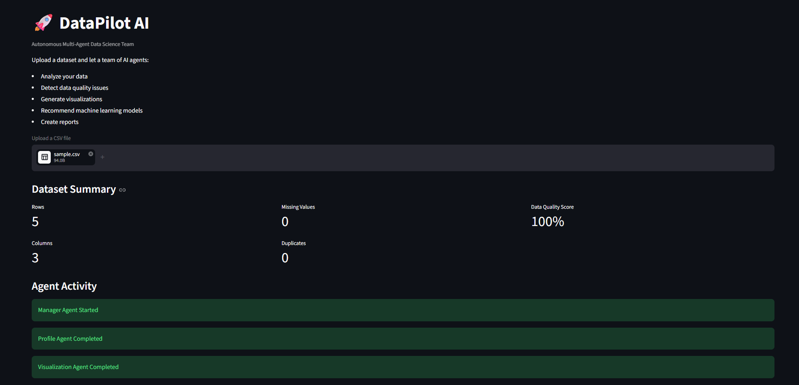
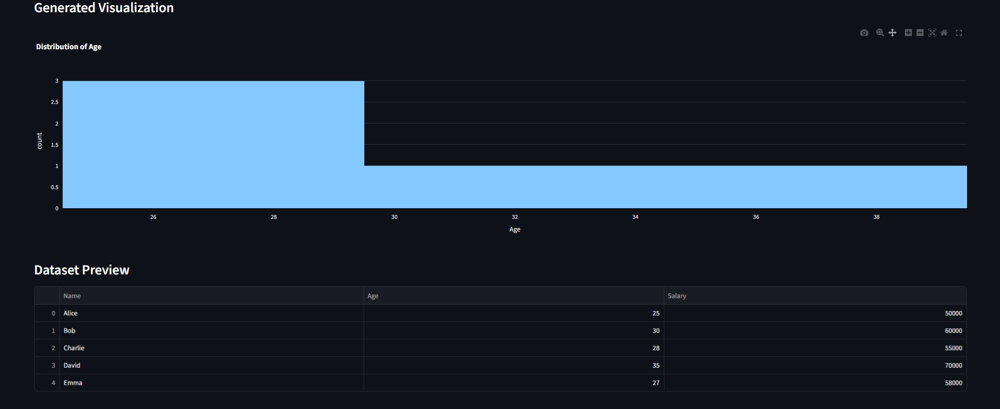
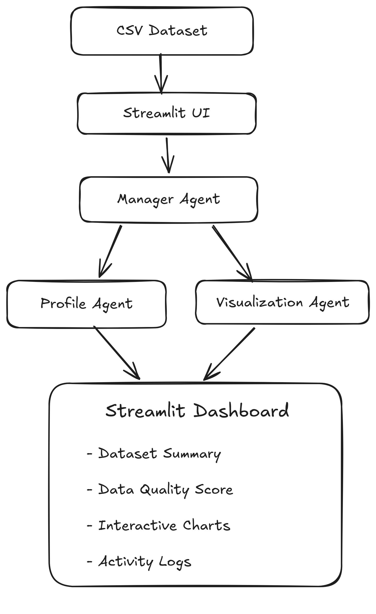

# 🚀 DataPilot AI

> **Autonomous Multi-Agent Data Analytics Platform**

DataPilot AI is a modular data analytics platform that automates the initial stage of exploratory data analysis through a collaborative multi-agent architecture. Users can upload a CSV dataset to receive an instant overview of data quality, summary statistics, and interactive visualizations generated by specialized agents.

The project demonstrates how independent software agents can work together to perform analytical tasks while remaining modular and easy to extend.

---

## Dashboard Preview





---

## Project Highlights

* Multi-agent architecture
* Automated dataset profiling
* Data quality assessment
* Interactive Plotly visualizations
* Streamlit dashboard
* Modular and extensible design

---

## Architecture



DataPilot AI follows a manager-worker architecture where the **Manager Agent** coordinates specialized agents responsible for dataset profiling and visualization. The generated insights are presented through an interactive Streamlit dashboard, providing users with a unified analytical experience.

---

## Features

### Dataset Profiling

* Dataset dimensions
* Missing value detection
* Duplicate detection
* Data quality score
* Column summary

### Visualization

* Automatic numeric column detection
* Interactive Plotly histogram generation
* Streamlit dashboard integration

### Agent Workflow

* Manager Agent
* Profile Agent
* Visualization Agent
* Execution logging

---

## Technology Stack

| Layer           | Technology         |
| --------------- | ------------------ |
| Language        | Python             |
| Framework       | Streamlit          |
| Data Processing | Pandas             |
| Visualization   | Plotly Express     |
| Architecture    | Multi-Agent System |

---

## Project Structure

```text
DataPilot-AI/
│
├── agents/
│   ├── manager_agent.py
│   ├── profile_agent.py
│   └── visualization_agent.py
│
├── assets/
├── data/
├── outputs/
│
├── app.py
├── requirements.txt
├── sample.csv
└── README.md
```

---

## Roadmap

**Completed**

* Multi-agent workflow
* Dataset profiling
* Data quality analysis
* Interactive visualization

**Planned**

* Data Cleaning Agent
* Insight Generation Agent
* Machine Learning Recommendation Agent
* Report Generation Agent
* LLM-powered dataset insights

---

## License

This project is intended for educational, research, and portfolio purposes.

---

If you have suggestions or ideas for improvement, feel free to open an issue or start a discussion.

⭐ If you found this project useful, consider giving it a star.
